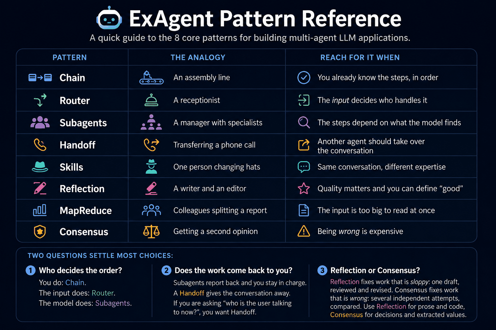

# ExAgent

Build multi-agent LLM applications in Elixir. One behaviour abstracts OpenAI, Gemini, and
any OpenAI-compatible endpoint; OTP primitives orchestrate them.

[Hex](https://hex.pm/packages/ex_agent) · [HexDocs](https://hexdocs.pm/ex_agent) · [](https://github.com/tiagodavi/ex_agent/actions/workflows/ci.yml)

- **Swap providers without touching application code** - one behaviour, struct-based config
- **Config-driven roles** - name a purpose (`:vision`, `:embed`), not a vendor
- **Structured streaming** - text, reasoning, tool-call deltas, usage as typed chunks
- **Automatic tool execution** - define a tool once; the agent loops until done
- **Multimodal** - images, PDFs, video, audio from a path, bytes, a URL, or an upload
- **Embeddings and reranking for RAG** - each provider's own task vocabulary, provenance on
  every result, cross-encoder reranking for the shortlist
- **Normalized errors** - one `%ExAgent.Error{}` with a `retryable?` flag
- **Fails loudly** - unsupported input is rejected before a request is built, never dropped
- **8 agent architectures** - Chain, Router, Subagents, Handoff, Skills, Reflection,
  MapReduce, Consensus, with a guide to picking one



## Install

```elixir
def deps do
  [{:ex_agent, "~> 0.3.0"}]
end
```

## Quick start

```elixir
provider = ExAgent.Providers.OpenAI.new(api_key: System.fetch_env!("OPENAI_API_KEY"))
{:ok, agent} = ExAgent.start_agent(provider: provider)

{:ok, response} = ExAgent.chat(agent, "What is Elixir?")
response.content   #=> "Elixir is a functional programming language..."
```

---

## Contents

| | |
|---|---|
| [Providers](#providers) · [Roles](#roles) | Configure who answers |
| [Agents](#agents) · [Tools](#tools) · [Streaming](#streaming) | Run a conversation |
| [Attachments](#attachments) · [Uploads](#uploads) | Send files |
| [Embeddings](#embeddings) · [Jina v5](#jina-v5) · [Reranking](#reranking) | RAG |
| [Tutorial](#tutorial-build-it-up-step-by-step) | 11 steps, easy to hard, all runnable |
| [Pattern reference](#pattern-reference) | The 8 architectures, side by side |
| [Observability](#observability) | Telemetry events |
| [Recipes](#recipes) | Retry, RAG, multi-tenant, LiveView, testing |
| [Custom providers](#custom-providers) · [Architecture](#architecture) · [Testing](#testing) | Extend |

---

## Providers

Every provider is a struct built by `new/1`, which validates options and prepares a `Req`
client. Pass it to `start_agent/1` or use it directly.

```elixir
ExAgent.Providers.OpenAI.new(
  api_key: "sk-...",                  # required
  model: "gpt-4o",                    # default
  system_prompt: "You are concise.",
  temperature: 0.6,               # omitted from the request when unset
  max_tokens: 4096                # omitted when unset, so the model's own ceiling applies
)

ExAgent.Providers.Gemini.new(
  api_key: "AIza...",                 # required
  model: "gemini-3.6-flash"           # default
)
```

### OpenAI-compatible (vLLM, Modal, OpenRouter, Together, Groq)

One provider for any endpoint speaking the OpenAI chat-completions dialect. Unlike
`Providers.OpenAI`, it accepts arbitrary auth headers - which is what makes Modal's proxy
auth reachable.

```elixir
provider = ExAgent.Providers.OpenAICompatible.new(
  base_url: System.fetch_env!("MODAL_URL") <> "/v1",   # required, include /v1
  model: "Qwen/Qwen3-VL-8B-Instruct",                  # required
  headers: [
    {"Modal-Key", System.fetch_env!("MODAL_KEY")},
    {"Modal-Secret", System.fetch_env!("MODAL_SECRET")}
  ],
  modalities: [:text, :image, :video],
  max_inline_bytes: 33_554_432
)

# Gateways using bearer auth: :api_key is sugar for Authorization: Bearer.
# Explicit :headers override it rather than being sent alongside.
ExAgent.Providers.OpenAICompatible.new(
  base_url: "https://openrouter.ai/api/v1",
  model: "meta-llama/llama-3.3-70b-instruct",
  api_key: System.fetch_env!("OPENROUTER_API_KEY"),
  modalities: [:text, :image]
)

# Container swaps where config still names the old model are a common failure.
case ExAgent.Providers.OpenAICompatible.probe(provider) do
  :ok -> :ready
  {:error, error} -> Logger.warning(Exception.message(error))
end
```

There is **no Files API** here: bytes always become `data:` URIs, and anything past
`:max_inline_bytes` returns `{:error, %ExAgent.Error{type: :unsupported}}` telling you to
host it at a URL the container can reach - never truncated, never retried. A
`%{file_ref: ref}` from another provider is rejected for the same reason.

### Modalities are per model, not per vendor

`o1-mini` reads no images; a text-only Gemini could ship tomorrow. Every provider takes
`:modalities`, and narrowing makes the gate fire before any request is built.

```elixir
provider = ExAgent.Providers.OpenAI.new(api_key: key, model: "o1-mini", modalities: [:text])
{:ok, agent} = ExAgent.start_agent(provider: provider)

ExAgent.chat(agent, "Describe this", files: [%{path: "photo.jpg"}])
#=> {:error, %ExAgent.Error{type: :unsupported}}
```

| Modality | OpenAI | Gemini | OpenAICompatible |
|---|---|---|---|
| `:text` | ✅ | ✅ | ✅ |
| `:image` | ✅ | ✅ | declare it |
| `:document` | ✅ | ✅ | declare it |
| `:video` | ❌ | ✅ | declare it |
| `:audio` | ❌ | ✅ | declare it |

`:text` is always present - it is what a plain message is. The rest are *defaults* you can
narrow or widen. ExAgent keeps no model-to-modality table on purpose: it would go stale
silently, and whoever picked the model already knows.

"Declare it" means `OpenAICompatible` ships `[:text]` and you list what your deployment
actually serves - including `:document`, for a gateway fronting a document-reading model:

```elixir
ExAgent.Providers.OpenAICompatible.new(
  base_url: "https://openrouter.ai/api/v1",
  model: "anthropic/claude-sonnet-4.5",
  api_key: key,
  modalities: [:text, :image, :document]
)
```

Nothing here is validated against the endpoint until a request is made, so declare only
what the served model actually reads.

## Roles

Declare which provider serves which purpose in config, then name the purpose at the call
site. Swapping a hosted model for a self-hosted container becomes a one-file change.

```elixir
# config/runtime.exs
config :ex_agent, :roles,
  chat: {ExAgent.Providers.Gemini, api_key: System.fetch_env!("GEMINI_API_KEY")},
  vision: {ExAgent.Providers.OpenAICompatible,
             base_url: System.fetch_env!("MODAL_URL") <> "/v1",
             model: "Qwen/Qwen3-VL-8B-Instruct",
             modalities: [:text, :image]},
  embed: {ExAgent.Providers.JinaV5, base_url: System.fetch_env!("JINA_URL")}
```

Role names are arbitrary atoms - `:ocr`, `:cheap_summarizer`, whatever fits. A bare module
means "that module with no options".

```elixir
# Roles are sugar: provider!/1 returns an ordinary struct usable everywhere.
{:ok, agent} = ExAgent.start_agent(provider: ExAgent.provider!(:vision))
{:ok, agent} = ExAgent.start_agent(role: :vision, tools: [...])   # shorthand

ExAgent.roles()          #=> [:chat, :vision, :embed]
ExAgent.provider(:nope)  #=> :error   (non-raising counterpart)
```

Stateless one-shot wrappers skip the agent process entirely:

```elixir
{:ok, response} = ExAgent.chat_with(:vision, "Invoice total?",
                    files: [%{url: "https://cdn.example.com/invoice.png"}])

ExAgent.stream_with(:chat, "Explain OTP") |> Enum.each(&IO.write(&1.text || ""))

{:ok, docs} = ExAgent.embed_with(:embed, chunks, task: :retrieval, args: [prompt_name: :document])
```

**These do not run the tool loop** - it lives in the agent. A tool-configured provider
returns the raw `{:tool_calls, calls}`. Use `start_agent(role: ..., tools: [...])`
when you want tools resolved.

Roles resolve **once at boot** into `:persistent_term`, so lookups cost nothing per
request. A module that is missing, lacks `new/1`, does not implement the behaviour, or
whose `new/1` raises fails the boot naming the role - a missing `GEMINI_API_KEY` crashes
at deploy time, not with a 401 at 3am. Vault-backed credentials can be a zero-arity
function or `{m, f, a}`, resolved once at boot:

```elixir
config :ex_agent, :roles,
  chat: {ExAgent.Providers.Gemini, api_key: {MyApp.Vault, :fetch, ["gemini"]}}
```

`provider!/2` merges overrides and returns a *fresh* struct - for per-tenant keys. It
rebuilds the `Req` client, so it is fine per request but not in a tight loop:

```elixir
ExAgent.provider!(:chat, api_key: tenant.openai_key, model: "gpt-4o-mini")
```

If you assemble role config after boot, call `ExAgent.Roles.build!/0` yourself.

## Agents

Agents are GenServers under a DynamicSupervisor. They hold conversation context and run
the tool loop.

```elixir
{:ok, agent} = ExAgent.start_agent(
  provider: provider,
  id: "support-42",
  tools: [weather_tool],
  skills: [sql_skill],
  built_in_tools: [:web_search],
  name: {:global, "support-42"}       # optional GenServer registration
)

{:ok, response} = ExAgent.chat(agent, "What's the weather in Tokyo?")
task = ExAgent.chat_async(agent, "Tell me a story");  {:ok, response} = Task.await(task)

ExAgent.get_context(agent).messages   # full history
ExAgent.reset(agent)                  # clear context
ExAgent.stop_agent(agent)
```

One turn at a time: while a request is in flight, `chat/3` returns `{:error, :busy}`.

### Multi-turn conversations

An agent **is** the conversation. Every turn is appended to its context and the whole
history is resent on the next request - you never assemble a message list yourself.

```elixir
{:ok, agent} = ExAgent.start_agent(provider: provider)

{:ok, _} = ExAgent.chat(agent, "My name is Ada.")
{:ok, r} = ExAgent.chat(agent, "What is my name?")
r.content   #=> "Your name is Ada."

Enum.map(ExAgent.get_context(agent).messages, & &1.role)
#=> [:user, :assistant, :user, :assistant]

ExAgent.reset(agent)   # forget everything; the system prompt still applies
```

Attachments are part of that history too, so a follow-up turn can refer back to a file
sent earlier without resending it.

History is **unbounded by default** - every turn resends the whole transcript, so cost
climbs turn over turn until the model returns `:context_length`. Cap it when a
conversation is long-lived:

```elixir
{:ok, agent} = ExAgent.start_agent(provider: provider, max_history: 20)
```

Leading system messages always survive the window, and a tool result is never left
without the assistant message that requested it. Trimming is opt-in because silently
forgetting what a user said is your decision, not the library's.

### System prompts and instructions

The system prompt lives on the **provider struct**, not in the context. It is prepended to
every request and is never stored as a message, so `reset/1` cannot lose it and it cannot
be pushed out of the window by history.

```elixir
provider = ExAgent.Providers.OpenAI.new(
  api_key: key,
  system_prompt: "You are a terse assistant. Answer in one sentence."
)

{:ok, agent} = ExAgent.start_agent(provider: provider)
```

Three ways to vary instructions, in increasing order of dynamism:

```elixir
# 1. Fixed for this agent - set it on the provider, as above.

# 2. Per conversation - build a provider per agent
{:ok, pirate} = ExAgent.start_agent(provider: %{provider | system_prompt: "Talk like a pirate."})

# 3. Conditional on the conversation - a Skill swaps in a prompt (and tools)
#    when its activation_fn matches. See "Skills" below.
{:ok, agent} = ExAgent.start_agent(provider: provider, skills: [sql_skill])
```

To steer a single turn without changing the agent, put the instruction in the message -
it becomes part of the history like any other user turn:

```elixir
ExAgent.chat(agent, "Reply as JSON only.\n\nList three Elixir books.")
```

### Seeding or restoring history

Rehydrate a conversation from your database - build a `Context` and hand it to a fresh
agent. This is the same mechanism the Handoff pattern uses.

```elixir
context =
  Enum.reduce(rows_from_db, ExAgent.Context.new(), fn row, ctx ->
    {:ok, msg} = ExAgent.Message.new(role: row.role, content: row.content)
    ExAgent.Context.add_message(ctx, msg)
  end)

{:ok, agent} = ExAgent.start_agent(provider: provider)
:ok = ExAgent.handoff(agent, context)          # replaces the agent's context

{:ok, r} = ExAgent.chat(agent, "What did we decide?")
```

Persisting works the other way round - `get_context/1` after each turn:

```elixir
for %ExAgent.Message{role: role, content: content} <- ExAgent.get_context(agent).messages do
  Repo.insert!(%Turn{conversation_id: id, role: to_string(role), content: content})
end
```

`ExAgent.Context.get_last_assistant_message/1` pulls just the latest reply, and
`ExAgent.Context.new(metadata: %{...})` carries your own bookkeeping alongside the
messages.

### Response

`chat/3` and `collect/1` both return the same struct, so streaming and non-streaming share
one downstream path.

```elixir
response.content        #=> "Elixir is a functional language..."
response.usage          #=> %{input_tokens: 8, output_tokens: 96, total_tokens: 104}
response.finish_reason  #=> :stop | :length | :tool_calls | :content_filter | :error
response.tool_calls     #=> nil, or [%{"id" => ..., "name" => ..., "args" => %{}}]
response.thinking       #=> reasoning trace, when the model emitted one
response.message        #=> the %ExAgent.Message{} appended to history
```

`:thinking` is deliberately kept out of `:message` - reasoning is not conversation
history, and replaying it corrupts the next turn.

### Errors

Every failed operation returns `{:error, %ExAgent.Error{}}` in one vocabulary, so retry
logic is written once rather than per provider.

```elixir
case ExAgent.chat(agent, "Summarize this") do
  {:ok, response} -> response
  {:error, %ExAgent.Error{retryable?: true} = e} -> retry_with_backoff(e)
  {:error, %ExAgent.Error{type: :context_length}} -> summarize_history_and_retry()
  {:error, %ExAgent.Error{} = e} -> Logger.error(Exception.message(e))
end
```

| Type | Meaning | `retryable?` |
|---|---|---|
| `:auth` | Bad or missing credentials (401, 403) | ❌ |
| `:not_found` | Unknown model or resource (404) | ❌ |
| `:timeout` | Request timed out (408, transport) | ✅ |
| `:rate_limit` | Rate or quota limit hit (429) | ✅ |
| `:context_length` | Input exceeds the context window | ❌ |
| `:invalid_request` | Malformed request (other 4xx) | ❌ |
| `:unsupported` | The provider cannot do this at all | ❌ |
| `:server` | Provider-side failure (5xx, bad shape) | ✅ |
| `:transport` | Connection-level failure | ✅ |

`:raw` carries the provider's original body and `:provider` names the module. `Error` is
also an exception, so it can be raised where no return value exists.

## Tools

Define a function the LLM can invoke. The agent loops - call, execute, feed the result
back - until a final answer or 10 iterations (`max_tool_iterations:` to change it).

```elixir
{:ok, weather_tool} = ExAgent.Tool.new(
  name: "get_weather",
  description: "Get current weather for a city",
  parameters: %{
    "type" => "object",
    "properties" => %{"city" => %{"type" => "string"}},
    "required" => ["city"]
  },
  function: fn %{"city" => city} -> {:ok, "#{city}: 22C, sunny"} end
)

{:ok, agent} = ExAgent.start_agent(provider: provider, tools: [weather_tool])
{:ok, response} = ExAgent.chat(agent, "Should I take a coat in Tokyo?")
```

A tool returns `{:ok, result}`, `{:error, reason}` (fed back to the LLM as an error), or
any bare value - which is taken as the result. A result that is not a string is JSON
encoded, so returning a map or list from an API-backed tool is fine.

A model can request **several tools in one turn**. All of them run, in order, each with
its own result correlated back by the provider's call id.

### Built-in provider tools

Enable at agent creation (all calls) or per message (overrides the agent default).

```elixir
# Gemini: :google_search, :code_execution, :url_context
{:ok, agent} = ExAgent.start_agent(provider: gemini, built_in_tools: [:google_search])
{:ok, r} = ExAgent.chat(agent, "Compute fibonacci(20)", built_in_tools: [:code_execution])

# OpenAI: :web_search. Two constraints come from OpenAI, not ExAgent -
# only a *-search-preview model accepts it, and those models reject `temperature`.
provider = ExAgent.Providers.OpenAI.new(
  api_key: key, model: "gpt-4o-search-preview", temperature: nil
)
{:ok, agent} = ExAgent.start_agent(provider: provider, built_in_tools: [:web_search])

# ...with location for localized results
ExAgent.chat(agent, "Best restaurants nearby",
  built_in_tools: [%{web_search: %{"city" => "Lisbon", "country" => "PT"}}])
```

ExAgent forwards `temperature` as configured rather than dropping it when a model objects
- a silently ignored sampling parameter is worse than a 400 naming the field.

## Streaming

```elixir
agent
|> ExAgent.chat_stream("Explain OTP supervision step by step")
|> Enum.each(fn
  %ExAgent.Chunk{type: :text_delta, text: text} -> IO.write(text)
  %ExAgent.Chunk{type: :thinking_delta, text: t} -> IO.write(IO.ANSI.faint() <> t)
  %ExAgent.Chunk{type: :done, finish_reason: reason} -> IO.puts("\n[#{reason}]")
  _chunk -> :ok
end)
```

| Chunk type | Carries |
|---|---|
| `:text_delta` | `:text` - a piece of the answer |
| `:thinking_delta` | `:text` - a piece of the reasoning trace |
| `:tool_call_delta` | `:index`, `:id`, `:name`, `:arguments` |
| `:usage` | `:usage` - token counts |
| `:done` | `:finish_reason`, plus `:error` when the stream failed |

**Streaming never raises.** A busy agent, an HTTP error, a dropped connection, and an idle
timeout all arrive as the terminal `:done` chunk carrying an `ExAgent.Error`. Every stream
ends with exactly one `:done`, and whatever text already arrived stays valid.

```elixir
agent
|> ExAgent.chat_stream("Summarize this")
|> Enum.each(fn
  %ExAgent.Chunk{type: :text_delta, text: t} -> IO.write(t)
  %ExAgent.Chunk{type: :done, error: %ExAgent.Error{retryable?: true}} -> retry()
  %ExAgent.Chunk{type: :done, error: %ExAgent.Error{} = e} -> Logger.error(e.message)
  _ -> :ok
end)
```

`:arguments` is a **raw JSON fragment**, not a decoded map - providers split function
arguments across chunks, concatenated by `:index`. `collect/1` handles that:

```elixir
{:ok, response} = agent |> ExAgent.chat_stream("Explain OTP") |> ExAgent.collect()
```

Tool-call turns resolve first without streaming; only the final turn streams. Context is
committed when the stream is **fully consumed**, so the stream must be consumed.

Streaming straight from a provider skips the agent, its context, and the tool loop:

```elixir
{:ok, msg} = ExAgent.Message.new(role: :user, content: "Why is the sky blue?")
provider |> ExAgent.Provider.stream([msg]) |> Enum.each(&IO.write(&1.text || ""))
```

## Attachments

An attachment carries exactly one source - `:path`, `:data`, `:url`, or `:file_ref`. Files
stay in conversation context, so follow-up turns can reference them.

```elixir
ExAgent.chat(agent, "Describe this", files: [%{path: "photo.jpg"}])
ExAgent.chat(agent, "What's here?",  files: [%{data: File.read!("d.png")}])
ExAgent.chat(agent, "Read this",     files: [%{url: "https://cdn.example.com/inv.png"}])
ExAgent.chat(agent, "Summarize",     files: [%{file_ref: ref}])

# Mix sources and types freely
ExAgent.chat(agent, "Compare these", files: [
  %{path: "report.pdf"},
  %{url: "https://cdn.example.com/data.csv"},
  %{data: notes, mime_type: "text/markdown"}
])

# The LLM still remembers them next turn
ExAgent.chat(agent, "Now focus on the second document")
```

### MIME types

Inferred from the extension for `:path` and `:url` (query strings ignored) and from magic
bytes for `:data`. **ExAgent never guesses** - when inference fails you get
`{:error, %ExAgent.Error{type: :invalid_request}}` naming `:mime_type`.

```elixir
# inferred: image/png (the query string is ignored)
ExAgent.chat(agent, "Read this", files: [%{url: "https://cdn.example.com/s.png?sig=abc"}])

# explicit: the extension says nothing useful
ExAgent.chat(agent, "Parse this", files: [%{path: "/tmp/export", mime_type: "text/csv"}])

# explicit: a CDN URL with no extension at all
ExAgent.chat(agent, "Describe this",
  files: [%{url: "https://picsum.photos/id/237/800/600", mime_type: "image/jpeg"}])
```

### Inline or uploaded - chosen for you

| Source | Delivery |
|---|---|
| `:url` | Referenced as-is - **never fetched** by ExAgent |
| `:file_ref` | Referenced as-is - already uploaded |
| Bytes under the inline ceiling | Base64 `data:` URI |
| Bytes over it | Uploaded through the Files API, then referenced |

**Gemini** inlines to 20 MB (50 MB for PDFs), then uses the Files API and waits for
`ACTIVE` - large files and video sit in `PROCESSING`, and referencing them early fails.
**OpenAI** inlines to 20 MB, then uploads documents and references them by `file_id`.

> #### OpenAI cannot reference an uploaded image {: .warning}
>
> Chat completions has no content part for one: `image_file` is the Assistants API's
> shape, `image_url` requires a real URL, and the `file` part accepts PDFs only. An image
> over the inline ceiling, or an image `file_ref`, therefore returns
> `{:error, %ExAgent.Error{type: :unsupported}}` rather than spending an upload on a
> request that would always fail. Resize it, or host it and pass `%{url: ...}`.

Uploads are cached by content hash, scoped per provider + base URL + API key, so the same
file across turns uploads once and two accounts never share a reference. An expired
`FileRef` is re-uploaded automatically.

```elixir
ExAgent.Providers.Gemini.new(api_key: key, upload_cache: false)   # opt out
```

`:path` reads only the file size up front; bytes are read at request time, so a 40 MB
video is not carried in history every turn.

### Video

```elixir
ExAgent.chat(agent, "Summarize both clips",
  files: [
    %{url: "https://cdn.example.com/clip.mp4", fps: 2},
    %{path: "talk.mp4", provider_opts: %{"start_offset" => "10s"}}
  ])
```

`:fps` maps to Gemini's `video_metadata` and rides along on OpenAI-compatible video parts.
Anything string-keyed under `:provider_opts` is merged into the media part verbatim.
`:max_frames` is normalized but has no field in Gemini's API, so Gemini ignores it.

### Supported types

| Type | MIME | Modality |
|---|---|---|
| JPEG / PNG / GIF / WebP | `image/*` | `:image` |
| PDF / TXT / Markdown / CSV | `application/pdf`, `text/*` | `:document` |
| MP4 / QuickTime / WebM | `video/*` | `:video` |
| MP3 / WAV / M4A / FLAC | `audio/*` | `:audio` |

Custom providers declare support via `c:ExAgent.Provider.supported_modalities/1`. Omitting
it means text only - a provider that has not opted in fails loudly rather than quietly
discarding attachments.

## Uploads

Upload once, reference many times - no base64 on every request.

```elixir
{:ok, ref} = ExAgent.upload_file(provider, "report.pdf", "application/pdf")
{:ok, ref} = ExAgent.upload_data(provider, File.read!("shot.png"), "image/png",
                                 filename: "shot.png")

ExAgent.chat(agent, "Summarize this report", files: [%{file_ref: ref}])
ExAgent.chat(agent, "What are the key findings?", files: [%{file_ref: ref}])

ExAgent.FileRef.expired?(ref)   # Gemini files expire after 48h

# Mix uploaded and inline in one message
ExAgent.chat(agent, "Compare these", files: [
  %{file_ref: video_ref},
  %{path: "thumbnail.jpg"}
])
```

## Embeddings

Stateless - takes a provider struct, no agent. Task atoms below are Gemini's; see
[Tasks belong to the provider](#tasks-belong-to-the-provider).

```elixir
provider = ExAgent.Providers.Gemini.new(api_key: System.fetch_env!("GEMINI_API_KEY"))

{:ok, docs}  = ExAgent.embed(provider, ["Elixir is functional", "OTP supervises"],
                             task: :retrieval_document)
{:ok, query} = ExAgent.embed(provider, "what supervises processes?",
                             task: :retrieval_query)

docs.vectors
|> Enum.map(&ExAgent.Embeddings.cosine_similarity(&1, hd(query.vectors)))
|> Enum.with_index()
|> Enum.max_by(&elem(&1, 0))
```

### Store provenance with every vector

> **Embedding spaces are model-scoped.** Vectors from different models, dimensions, or
> tasks are not comparable, and mixing them degrades retrieval *silently* rather than
> failing. The only fix is a full re-embed.

```elixir
{:ok, result} = ExAgent.embed(provider, chunks, task: :retrieval_document)

Enum.zip(chunks, result.vectors)
|> Enum.map(fn {chunk, vector} ->
  %{text: chunk, embedding: vector,
    model: result.model, dimensions: result.dimensions, task: result.task}
end)
```

That turns a later model change into a detectable migration instead of a quiet regression.

### Tasks belong to the provider

`:task` says what the embedding is *for*, as an atom from **that provider's** vocabulary.
There is no shared set, because there is no honest one: Gemini's `taskType` is a closed
enum of eight, Jina v5 has four names plus a separate `prompt_name`, and OpenAI has no task
field at all. A common vocabulary would have to drop distinctions a model makes or invent
ones it does not.

```elixir
ExAgent.embedding_tasks(gemini)   #=> [:retrieval_query, :retrieval_document, :similarity, ...]
ExAgent.embedding_tasks(jina)     #=> [:retrieval, :text_matching, :clustering, :classification]
ExAgent.embedding_tasks(openai)   #=> []
```

An unknown task is an error naming the accepted ones. Strings are rejected too - an
endpoint that does not recognize a task string answers 200 and leaves quietly wrong vectors
in your index, with no later signal.

**Gemini** additionally has two model families: `gemini-embedding-001` takes the `taskType`
enum, while `gemini-embedding-2` has no such field and writes a text prefix instead (with
`:title` filling the document template). The family is inferred from the model name;
`:embedding_family` overrides it for a model this release does not know.

```elixir
ExAgent.embed(gemini, [%{content: "body", title: "OTP Guide"}],
  model: "gemini-embedding-2", task: :retrieval_document)
```

**OpenAI** errors on any `:task` rather than dropping it silently.

### Jina v5

An embeddings-only provider for a **self-hosted** v5 server. v5 splits what earlier
versions fused: `task` says what kind of embedding, and `prompt_name` says which side of a
retrieval pair.

```elixir
jina = ExAgent.Providers.JinaV5.new(base_url: System.fetch_env!("JINA_URL"))

{:ok, docs}  = ExAgent.embed(jina, chunks, task: :retrieval, args: [prompt_name: :document])
{:ok, query} = ExAgent.embed(jina, "what supervises processes?",
                             task: :retrieval, args: [prompt_name: :query])
```

Behind Modal's proxy auth:

```elixir
ExAgent.Providers.JinaV5.new(
  base_url: System.fetch_env!("MODAL_JINA_URL"),
  api_key: System.fetch_env!("MODAL_API_KEY"),
  headers: [
    {"Modal-Key", System.fetch_env!("MODAL_KEY")},
    {"Modal-Secret", System.fetch_env!("MODAL_SECRET")}
  ]
)
```

`prompt_name` is **required** for `:retrieval` and rejected for the other three tasks -
both rules are the server's, enforced here so the failure arrives before the round trip:

```elixir
ExAgent.embed(jina, chunks, task: :retrieval)
#=> {:error, %ExAgent.Error{message: "task :retrieval needs args: [prompt_name: :query] " <>
#=>          "for the search side or [prompt_name: :document] for the indexed side..."}}
```

Encoding both sides of a retrieval pair the same way is not an error anywhere - it just
degrades recall invisibly, and the fix is a full re-embed. That is why there is no default.

1024 dimensions, Matryoshka-truncatable to 32, 64, 128, 256, 512, or 768; an untrained
width is refused. The server truncates *and* re-normalizes, so ExAgent does not touch the
vectors - `args: [normalize: false]` gives you the raw truncated one, which is not unit
length. Batches are capped at 512 inputs.

#### The server contract

Verified against a running deployment rather than inferred. `POST {base_url}/embed`:

```json
{"texts": ["..."], "task": "retrieval", "prompt_name": "document",
 "dimensions": 256, "normalize": true}
```

```json
{"model": "...", "task": "...", "prompt_name": "...",
 "dimensions": 256, "input_count": 1, "embeddings": [[...]]}
```

The server rejects unknown body fields, which is why `:args` is a closed allowlist rather
than a passthrough. This is **not** the shape of Jina's hosted `api.jina.ai` service, which
speaks an OpenAI-style `/v1/embeddings`; pointing this provider there will not work.

Note that `OpenAICompatible` has **no** embeddings support: "any endpoint" cannot have a
task vocabulary, and the shared task map that used to fake one guessed wrong as soon as
Jina renamed its tasks in v5.

### Extra model arguments

`:args` forwards key-value pairs into the request body for parameters this library does not
model. Each provider validates them against its own endpoint, so a typo fails loudly
instead of being ignored by the server:

```elixir
ExAgent.embed(jina, chunks, task: :retrieval, args: [prompt_name: :document])
ExAgent.embed(openai, chunks, args: [encoding_format: "base64"])

ExAgent.embed(jina, chunks, task: :clustering, args: [prompt_nane: :document])
#=> {:error, %ExAgent.Error{message: "JinaV5 does not accept :prompt_nane in :args; " <>
#=>          "it accepts [:prompt_name, :normalize]"}}
```

### Models and dimensions

`:model` is always the *embedding* model, never the provider's chat model - defaults are
`text-embedding-3-small` (OpenAI) and `gemini-embedding-001` (Gemini).

`:dimensions` truncates where supported. `gemini-embedding-001` does not renormalize a
truncated vector, so ExAgent rescales client-side; cosine similarity assumes unit length.

An unrecognized Gemini embedding model **errors rather than guessing** - sending a
`taskType` to a model that ignores it returns HTTP 200 with plausible floats that land in
your index and retrieve worse forever. Use `:embedding_family` (`:task_type` or `:prefix`)
to adopt a model this version predates.

## Reranking

Retrieval's second stage. Embeddings compare vectors computed independently, which is what
makes searching a corpus feasible; a **cross-encoder** reads the query and one document
together - far more accurate, and far too slow to run over everything.

```elixir
reranker = ExAgent.Providers.JinaRerankerM0.new(base_url: System.fetch_env!("RERANKER_URL"))

# Stage 1: embeddings fetch a shortlist of ~100
shortlist = vector_search(query_vector, limit: 100)

# Stage 2: the reranker orders the ~10 that go in the prompt
{:ok, ranked} = ExAgent.rerank(reranker, question, Enum.map(shortlist, & &1.text), top_n: 10)
```

`:index` is the contract - it points back into the list you passed, so it works for records,
not just strings:

```elixir
Enum.map(ranked.results, fn %{index: i, score: score} -> {Enum.at(shortlist, i), score} end)

ExAgent.Reranking.take(ranked, texts)        # ranked texts, when that is all you need
ExAgent.Reranking.above(ranked, 0.5).results # decline to answer instead of guessing
```

`:document` is nil unless you pass `return_documents: true` - sending a corpus back to have
it re-quoted is waste when the index already identifies it.

Behind Modal's proxy auth:

```elixir
ExAgent.Providers.JinaRerankerM0.new(
  base_url: System.fetch_env!("MODAL_RERANKER_URL"),
  api_key: System.fetch_env!("MODAL_API_KEY"),
  headers: [
    {"Modal-Key", System.fetch_env!("MODAL_KEY")},
    {"Modal-Secret", System.fetch_env!("MODAL_SECRET")}
  ]
)
```

> #### Scores do not port between models {: .warning}
>
> Higher is more relevant - that is the only guarantee. `jina-reranker-m0` emits roughly
> 0-1 while other cross-encoders emit unbounded logits, so compare **within** one result
> set and calibrate any threshold against your own data. Store `:model` next to anything you
> persist, for the same reason embeddings do.

Ranking always returns something: the best of an entirely irrelevant set still sorts first.
`above/2` is how you decline rather than feed the model the least-irrelevant chunk.

Batches are capped at 512 documents - the shape of the intended use. A provider without a
reranking endpoint returns `{:error, %ExAgent.Error{type: :unsupported}}`.

## Tutorial: build it up step by step

Every example below is complete and was run against a real API before being published.
Set your key, open `iex -S mix`, and paste them in order: each adds exactly one idea and
builds on the last.

The outputs shown are from an actual run. Models are not deterministic, so your wording
will differ - the *shape* of the result is what to compare against.

```bash
export OPENAI_API_KEY=sk-...
iex -S mix
```

### Step 1. Ask one question

```elixir
provider = ExAgent.Providers.OpenAI.new(api_key: System.fetch_env!("OPENAI_API_KEY"))
{:ok, agent} = ExAgent.start_agent(provider: provider)

{:ok, response} = ExAgent.chat(agent, "In one sentence: what is a supervisor in OTP?")
IO.puts(response.content)
```

```
In OTP, a supervisor is a process responsible for starting, stopping, and monitoring
child processes, restarting them according to a specified strategy.
```

An **agent** is a process that holds a conversation. That is the whole idea.

### Step 2. It remembers

```elixir
{:ok, _} = ExAgent.chat(agent, "My name is Ana and I work on billing.")
{:ok, response} = ExAgent.chat(agent, "Which team did I say I work on?")
IO.puts(response.content)
#=> "You mentioned that you work on the billing team."
```

The agent keeps the history and resends it every turn. You never assemble a message
list yourself. `ExAgent.reset(agent)` forgets everything.

### Step 3. Give it a tool so it can look things up

A **tool** is one of *your* functions the model is allowed to call. Use one whenever the
answer lives in your database, not in the model.

```elixir
{:ok, order_lookup} =
  ExAgent.Tool.new(
    name: "order_status",
    description: "Look up the delivery status of an order by its ID",
    parameters: %{
      "type" => "object",
      "properties" => %{"order_id" => %{"type" => "string"}},
      "required" => ["order_id"]
    },
    function: fn %{"order_id" => id} ->
      # In real code: Repo.get(Order, id)
      %{order_id: id, status: "in transit", eta: "Thursday"}
    end
  )

{:ok, shop} = ExAgent.start_agent(provider: provider, tools: [order_lookup])

{:ok, response} = ExAgent.chat(shop, "Where is order A-1042?")
IO.puts(response.content)
#=> "Order A-1042 is currently in transit and is expected to arrive by Thursday."
```

The agent called your function, read the result, and answered. You never parsed
anything. Return a map or a list and it is JSON encoded for you.

### Step 4. One agent, several hats (Skills)

Your support agent should sound normal most of the time, but must quote the policy
exactly when refunds come up. A **skill** swaps the instructions in and out
automatically, in the same conversation.

```elixir
{:ok, refunds} =
  ExAgent.Skill.new(
    name: "refunds",
    system_prompt: "You are a refunds specialist. Quote the 30-day policy in every answer.",
    activation_fn: fn ctx -> List.last(ctx.messages).content =~ ~r/refund|money back/i end
  )

{:ok, desk} =
  ExAgent.start_agent(
    provider: ExAgent.Providers.OpenAI.new(
      api_key: System.fetch_env!("OPENAI_API_KEY"),
      system_prompt: "You are a friendly support agent. Keep answers to one sentence."
    ),
    skills: [refunds]
  )

{:ok, a} = ExAgent.chat(desk, "Hi, do you ship to Portugal?")
{:ok, b} = ExAgent.chat(desk, "I want a refund for order A-1042.")
{:ok, c} = ExAgent.chat(desk, "And do you ship to Spain?")

IO.puts(a.content)   #=> "Yes, we do ship to Portugal."
IO.puts(b.content)   #=> "...within our 30-day return policy window..."
IO.puts(c.content)   #=> "Yes, we ship to Spain."
```

Watch the third answer: the skill switched **off** again by itself. One agent, one
conversation, different expertise as needed.

### Step 5. Ask a specialist without leaving the conversation (Subagents)

Now the policy is 40 pages. You do not want it in your main agent's instructions, so
put it in a **subagent**: a separate model with its own instructions, exposed to your
agent as a tool.

```elixir
policy_expert =
  ExAgent.Providers.OpenAI.new(
    api_key: System.fetch_env!("OPENAI_API_KEY"),
    system_prompt: "You know the refund policy: 30 days, unopened, receipt required."
  )

tools =
  ExAgent.Patterns.Subagents.tools([
    %{name: "refund_policy",
      description: "Check the refund policy for an order",
      provider: policy_expert,
      system_prompt: nil,
      tools: []}
  ])

{:ok, front} = ExAgent.start_agent(provider: provider, tools: tools)

{:ok, response} = ExAgent.chat(front, "Can I return shoes I opened 40 days ago?")
IO.puts(response.content)
#=> "Unfortunately you cannot: they are opened and it is past the 30-day window."
```

Your agent asked the specialist, got an answer, and replied to the customer itself.
**The customer never left the conversation.** That is the difference from Step 6.

### Step 6. Hand the customer to another team (Handoff)

Some questions should not come back to you at all. A **handoff** gives the whole
conversation away, like transferring a phone call.

```elixir
key = System.fetch_env!("OPENAI_API_KEY")
persona = fn text -> ExAgent.Providers.OpenAI.new(api_key: key, system_prompt: text) end

{:ok, billing} = ExAgent.start_agent(provider: persona.("You are the billing team. Be brief."))

tools =
  ExAgent.Patterns.Handoff.tools([
    %{name: "billing", agent: billing, description: "Transfer invoices, charges or refunds"}
  ])

{:ok, front} =
  ExAgent.start_agent(
    provider: persona.("You are the front desk. Transfer billing topics, answer the rest."),
    tools: tools
  )

{:ok, r} = ExAgent.chat(front, "What are your opening hours?")
IO.puts(r.content)   #=> "Monday to Friday, 9:00 AM to 6:00 PM."

{:handoff, target, context} = ExAgent.chat(front, "I was charged twice for invoice 88.")

# You decide whether to allow the transfer. Nothing moves until you say so.
:ok = ExAgent.handoff(target, context)

{:ok, r} = ExAgent.chat(target, "So what happens next?")
IO.puts(r.content)
#=> "We'll review the billing records... expect an update within 3-5 business days."
```

#### Why call `handoff/2` before `chat/3`?

Because **`ExAgent.handoff/2` is what actually delivers the conversation. Without it the
target agent is a stranger.**

The same question, asked of the billing agent with and without that line, showing what
reached the model:

```
WITHOUT handoff/2 first
  provider saw: ["So what happens next?"]

WITH handoff/2 first
  provider saw: ["Handoff: charged twice for invoice 88.", "So what happens next?"]
```

Skip it and the billing agent is asked "So what happens next?" with no idea what "what"
refers to. So the order is: **deliver the history, then talk.**

That is all `handoff/2` does. It copies the context into the target's state:

```elixir
# ExAgent.Patterns.Handoff
def run(target, context), do: GenServer.cast(target, {:receive_handoff, context})

# ExAgent.Agent
def handle_cast({:receive_handoff, context}, state) do
  {:noreply, %{state | context: context, status: :idle}}
end
```

#### The tuple is a proposal, not a transfer

`{:handoff, target, context}` means the model *asked* to transfer and handed you a
summary. Nothing moved. The gap between the two lines is where your real code goes:
check the billing team is staffed, log it, redact the summary, or decline and answer
yourself. Declining is just not calling `handoff/2`.

Letting a model move a customer between teams on its own is a bad idea, so `chat/3`
stops and gives you the decision.

#### Is the cast a race?

`handoff/2` returns `:ok` immediately without waiting, so it looks like `chat/3` could
overtake it. It cannot. Erlang guarantees messages between **a pair of processes**
arrive in send order, so your cast is in the target's mailbox before your call. Measured
over 200 runs, the context was late 0 times.

The caveat is in the word *pair*: if one process calls `handoff/2` and a **different**
one calls `chat/3`, that guarantee no longer applies and you would have to synchronize
them yourself. Doing both from the same process, as here, is safe.

One last detail: the front desk is left with `status: :handed_off` but stays usable.
Handing off one customer does not retire the agent for the next.

### Steps 4 to 6, side by side

The three get confused constantly. The test is: **who answers the next message?**

| | Who answers next | Use it when |
|---|---|---|
| **Tool** (Step 3) | Same agent | You need a value: a price, a row, a calculation |
| **Skill** (Step 4) | Same agent, different instructions | The topic changed but the person should not |
| **Subagent** (Step 5) | Same agent, after consulting | Specialist knowledge you do not want in the main prompt |
| **Handoff** (Step 6) | A different agent, from now on | The conversation genuinely belongs to another team |

Rule of thumb: a subagent is a **phone call you make while the customer waits**. A
handoff is **passing the customer to a colleague**.

### Step 7. Fixed pipelines (Chain)

Real work is often several prompts in a known order. Doing it in one prompt does each
part worse.

```elixir
alias ExAgent.Patterns.Chain

transcript = """
Ana will fix the login bug by Friday. Bruno will email the client today.
We also agreed to postpone the redesign.
"""

{:ok, checklist} =
  Chain.run(transcript,
    steps: [
      Chain.llm(provider, &"List only the action items, one per line:\n\n#{&1}"),
      Chain.llm(provider, &"Convert to a markdown checklist with owners in bold:\n\n#{&1}")
    ]
  )

IO.puts(checklist)
#=> - [ ] **Ana** will fix the login bug by Friday.
#=> - [ ] **Bruno** will email the client today.
```

Any function is a step, so validation and database lookups sit in the line too. A step
returning `{:halt, reason}` stops early **without being an error**, which is how you
avoid paying for the rest:

```elixir
Chain.run("",
  steps: [
    fn text -> {:ok, String.trim(text)} end,
    fn text -> if text == "", do: {:halt, :empty_transcript}, else: {:ok, text} end,
    Chain.llm(provider, &"Summarise:\n\n#{&1}")   # never called
  ]
)
#=> {:halted, :empty_transcript}
```

That is also where a human belongs: halt with `:needs_approval`, park the work, and run
a second chain when someone signs off.

### Step 8. Make it check its own work (Reflection)

When quality matters and you can *say* what good looks like, have one model draft and
another review, in a loop.

```elixir
alias ExAgent.Patterns.Reflection

count_words = fn task, draft ->
  words = draft |> String.split(~r/\s+/, trim: true) |> length()

  """
  Task: #{task}
  Draft: #{draft}
  The draft has #{words} words. Reply exactly APPROVED only if it has exactly 7 words.
  Otherwise say what to change in one line.
  """
end

{:ok, result} =
  Reflection.run("Describe what an Erlang/OTP supervisor process does.",
    generator: provider,
    critic: provider,
    critic_prompt: count_words,
    max_rounds: 4
  )

IO.puts(result.output)
IO.inspect(result.rounds)
IO.inspect(Enum.map(result.critiques, &String.slice(&1, 0, 30)))
```

One real run converged like this:

```
"Supervisors restart failed child processes."
3
["needs exactly 7 words, has 158", "needs exactly 7 words, has 6",
 "needs exactly 7 words, has 7", "APPROVED"]
```

You can watch it work: 158 words, then 6, then 7, then approved. Another run may take
one round or hit the ceiling. That variability is exactly why the ceiling exists, and
why the next paragraph matters.

**Read the return value carefully.** If the critic never approves you get
`{:max_rounds, result}`, not `{:ok, result}`. The draft is still there, but using
unreviewed work has to be your choice:

```elixir
outcome =
  case Reflection.run("Write a haiku about supervisors.",
         generator: provider,
         critic: provider,
         accept?: &String.contains?(&1, "APPROVED"),
         max_rounds: 2
       ) do
    {:ok, result} -> {:send_it, result.output}
    {:max_rounds, result} -> {:needs_human, result.output, result.critiques}
    {:error, reason} -> {:failed, reason}
  end

IO.inspect(elem(outcome, 0))   #=> :send_it
```

### Step 9. Documents too big to read at once (MapReduce)

```elixir
alias ExAgent.Patterns.MapReduce

chapters = [
  "Elixir runs on the BEAM, which was built for telecom switches.",
  "Supervisors restart failed children, so crashes are contained.",
  "Processes are cheap: millions fit on one machine."
]

{:ok, result} =
  MapReduce.run(chapters, provider,
    map: &"Summarise in exactly 5 words:\n\n#{&1}",
    reduce: {provider, fn parts -> "Merge into one sentence:\n" <> Enum.join(parts, "; ") end}
  )

IO.puts(result.output)
IO.inspect(result.sections)   #=> 3
IO.inspect(result.failures)   #=> []
```

The chapters are summarised **at the same time**, not one after another: six sections
of 300 ms take 339 ms, not 1.8 s. One failing chapter does not fail the run, and
`:failures` tells you which ones were missing, because a summary of 38 of 40 interviews
is worth having but not worth mistaking for all 40.

### Step 10. When being wrong is expensive (Consensus)

```elixir
alias ExAgent.Patterns.Consensus

{:ok, verdict} =
  Consensus.run(
    "Does this describe a security vulnerability? Answer only YES or NO.\n\n" <>
      "The endpoint accepts a user-supplied path and reads that file without validation.",
    voters: provider,
    samples: 5,
    normalize: fn answer -> if String.contains?(String.upcase(answer), "YES"), do: :yes, else: :no end
  )

IO.inspect(verdict.answer)      #=> :yes
IO.inspect(verdict.agreement)   #=> 1.0
IO.inspect(verdict.votes)       #=> %{yes: 5}
```

Ask five times, take the answer that keeps coming up. The **disagreement** is the real
product: a low `:agreement` is your cue to escalate instead of proceeding.

```elixir
question = "Is the password 'admin123' strong enough for a bank? Answer only YES or NO."

decision =
  case Consensus.run(question, voters: provider, samples: 5) do
    {:ok, %{agreement: agreement} = verdict} when agreement >= 0.8 -> {:auto, verdict.answer}
    {:ok, verdict} -> {:needs_human, verdict.votes}
  end

IO.inspect(decision)   #=> {:auto, "no"}
```

Swap `voters: provider, samples: 5` for `voters: [gpt, gemini, local_llama]` to ask
three different models once each. That is stronger, because different models fail
differently, while one model asked five times often just repeats itself.

### Step 11. Everything at once: a real support desk

The patterns compose. This is a support pipeline that classifies, retrieves, drafts,
checks, and escalates.

```elixir
alias ExAgent.Patterns.{Chain, Consensus, Reflection}

handle_ticket = fn ticket ->
  Chain.run(ticket,
    steps: [
      # 1. Is this urgent? Ask three times, because getting it wrong is expensive.
      fn text ->
        {:ok, verdict} =
          Consensus.run("Is this ticket urgent? Answer only YES or NO.\n\n" <> text,
            voters: provider,
            samples: 3
          )

        {:ok, %{ticket: text, urgent?: verdict.answer == "yes", certainty: verdict.agreement}}
      end,

      # 2. Unclear urgency is a human's call, not a model's.
      fn state ->
        if state.certainty < 0.7, do: {:halt, {:needs_human, state}}, else: {:ok, state}
      end,

      # 3. Draft a reply, and hold it to a standard before it goes out.
      fn state ->
        case Reflection.run("Reply to this support ticket:\n\n" <> state.ticket,
               generator: provider,
               critic: provider,
               accept?: &String.contains?(&1, "APPROVED"),
               max_rounds: 2
             ) do
          {:ok, result} -> {:ok, Map.put(state, :reply, result.output)}
          {:max_rounds, result} -> {:halt, {:needs_human, Map.put(state, :draft, result.output)}}
          {:error, reason} -> {:error, reason}
        end
      end
    ]
  )
end

handle_ticket.("My payment failed three times and I have a demo tomorrow!")
```

Three outcomes, all explicit: `{:ok, state}` to send automatically,
`{:halted, {:needs_human, state}}` for a person to look at, `{:error, reason}` for a
real failure. Nothing silently guesses.

## Pattern reference

The tutorial above shows each pattern in use. This is the quick index.

| Pattern | The analogy | Reach for it when |
|---|---|---|
| **Chain** | An assembly line | You already know the steps, in order |
| **Router** | A receptionist | The *input* decides who handles it |
| **Subagents** | A manager with specialists | The steps depend on what the model finds |
| **Handoff** | Transferring a phone call | Another agent should take over the conversation |
| **Skills** | One person changing hats | Same conversation, different expertise |
| **Reflection** | A writer and an editor | Quality matters and you can define "good" |
| **MapReduce** | Colleagues splitting a report | The input is too big to read at once |
| **Consensus** | Getting a second opinion | Being *wrong* is expensive |

Two questions settle most choices:

**Who decides the order?** You do: **Chain**. The input does: **Router**. The model
does: **Subagents**.

**Does the work come back to you?** Subagents report back and you stay in charge. A
**Handoff** gives the conversation away. If you are asking "who is the user talking to
now?", you want Handoff.

**Reflection or Consensus?** Reflection fixes work that is *sloppy*: one draft,
reviewed and revised. Consensus fixes work that is *wrong*: several independent
attempts, compared. A critic re-reading one draft is easily talked into agreeing with
it, so reflection will not save you from a confidently wrong fact. Reflection for prose
and code, Consensus for decisions and extracted values.

### Router - one input, several specialists at once

Unlike Chain, the *input* picks who runs, and matching agents run in parallel.

```elixir
alias ExAgent.Patterns.Router

key = System.fetch_env!("OPENAI_API_KEY")
persona = fn text -> ExAgent.Providers.OpenAI.new(api_key: key, system_prompt: text) end

{:ok, security} = ExAgent.start_agent(provider: persona.("You are a security reviewer. One sentence."))
{:ok, performance} = ExAgent.start_agent(provider: persona.("You are a performance engineer. One sentence."))

routes = [
  %{name: "security", agent: security, match_fn: &String.contains?(&1, "auth")},
  %{name: "performance", agent: performance, match_fn: &String.contains?(&1, "slow")}
]

{:ok, combined} = Router.run("the auth endpoint is slow", routes: routes)
IO.puts(combined)
#=> ## security
#=> The auth endpoint should be reviewed for token validation overhead...
#=>
#=> ## performance
#=> Slow auth endpoints usually point to synchronous I/O or missing indexes...
```

Both matched here, so both ran and their answers were combined. Pass `:synthesizer` to
control the merge, and `:timeout` for the per-agent limit. A crashed or timed-out agent
is reported by name instead of taking the run down.

### API shape

Every pattern follows the same two rules:

- workflows you execute are `run/2` or `run/3`
- builders that hand tools to an agent are `tools/1`

```elixir
Chain.run(input, steps: [...])
Router.run(input, routes: [...])
Reflection.run(task, generator: ..., critic: ...)
MapReduce.run(sections, target, map: ..., reduce: ...)
Consensus.run(prompt, voters: ...)
Subagents.run(specs_with_inputs)          # several specialists in parallel
Handoff.run(target, context)              # deliver the conversation

Subagents.tools(specs)                    # -> [%ExAgent.Tool{}]
Handoff.tools(specs)                      # -> [%ExAgent.Tool{}]
```

Anywhere a pattern takes a target you may pass a **provider struct** (stateless, no
process) or a **running agent** (remembers the conversation).

## Observability

Every provider call emits `:telemetry` events, so latency and token spend are
measurable without wrapping the library. Nothing is logged on your behalf.

```elixir
:telemetry.attach_many(
  "ex-agent",
  [[:ex_agent, :chat, :stop], [:ex_agent, :embed, :stop], [:ex_agent, :tool, :stop]],
  &MyApp.Metrics.handle/4,
  nil
)

def handle([:ex_agent, :chat, :stop], measurements, metadata, _config) do
  MyApp.Metrics.histogram("llm.latency", measurements.duration, tags: [metadata.model])
  MyApp.Metrics.count("llm.tokens", measurements[:total_tokens] || 0)
end
```

`:result` is `:ok`, `:tool_calls`, or `:error`; a failure also carries `:error_type` and
`:retryable?`, which is what a retry-rate dashboard is built on. See `ExAgent.Telemetry`
for the full event table.

## Recipes

### Retry with backoff on transient failures

```elixir
def chat_with_retry(agent, input, attempt \\ 1) do
  case ExAgent.chat(agent, input) do
    {:error, %ExAgent.Error{retryable?: true}} when attempt < 4 ->
      Process.sleep(trunc(:math.pow(2, attempt) * 500))
      chat_with_retry(agent, input, attempt + 1)

    other ->
      other
  end
end
```

### RAG, end to end

```elixir
embedder = ExAgent.provider!(:embed)

# Index: embed documents, persist provenance next to each vector.
# Tasks are the provider's own - this is Jina v5's spelling; on Gemini the
# equivalent is task: :retrieval_document with no :args.
{:ok, result} =
  ExAgent.embed(embedder, chunks, task: :retrieval, args: [prompt_name: :document])

rows =
  Enum.zip(chunks, result.vectors)
  |> Enum.map(fn {text, vec} ->
    %{text: text, embedding: vec, model: result.model, task: result.task}
  end)

Repo.insert_all(Chunk, rows)

# Query: the *query* side, encoded differently. Using the document side here
# returns 200 and degrades recall with no signal.
{:ok, q} = ExAgent.embed(embedder, question, task: :retrieval, args: [prompt_name: :query])
[qv] = q.vectors

# Vector search fetches a shortlist; the reranker orders what actually goes in the prompt.
shortlist =
  rows
  |> Enum.sort_by(&ExAgent.Embeddings.cosine_similarity(&1.embedding, qv), :desc)
  |> Enum.take(50)

{:ok, ranked} =
  ExAgent.rerank(ExAgent.provider!(:reranker), question, Enum.map(shortlist, & &1.text),
    top_n: 5
  )

context = Enum.map(ranked.results, fn %{index: i} -> Enum.at(shortlist, i) end)
  |> Enum.map_join("\n\n", & &1.text)

{:ok, agent} = ExAgent.start_agent(role: :chat)
{:ok, answer} = ExAgent.chat(agent, """
Answer using only this context. Say "I don't know" if it is not there.

#{context}

Question: #{question}
""")
```

### Multi-tenant - a key per request

```elixir
def answer_for(tenant, question) do
  provider = ExAgent.provider!(:chat, api_key: tenant.openai_key, model: tenant.model)
  {:ok, agent} = ExAgent.start_agent(provider: provider)

  try do
    ExAgent.chat(agent, question)
  after
    ExAgent.stop_agent(agent)
  end
end
```

### Vision on a self-hosted container

```elixir
# config/runtime.exs
config :ex_agent, :roles,
  vision: {ExAgent.Providers.OpenAICompatible,
             base_url: System.fetch_env!("MODAL_URL") <> "/v1",
             model: "Qwen/Qwen3-VL-8B-Instruct",
             modalities: [:text, :image, :video],
             headers: [{"Modal-Key", System.fetch_env!("MODAL_KEY")},
                       {"Modal-Secret", System.fetch_env!("MODAL_SECRET")}]}
```

```elixir
# Images and video reach vLLM three ways: URL, local path (base64 data URI), raw bytes.
ExAgent.chat_with(:vision, "What is in this image?",
  files: [%{url: "https://cdn.example.com/x.jpg", mime_type: "image/jpeg"}])

ExAgent.chat_with(:vision, "Describe this video.",
  files: [%{path: "clip.mp4", fps: 1}])

# Two attachments in one turn become two content parts
ExAgent.chat_with(:vision, "Which of these is a chart?",
  files: [%{data: png_bytes, mime_type: "image/png"},
          %{url: "https://cdn.example.com/chart.png"}])
```

### Streaming into Phoenix LiveView

```elixir
def handle_event("ask", %{"q" => q}, socket) do
  parent = self()

  Task.start(fn ->
    socket.assigns.agent
    |> ExAgent.chat_stream(q)
    |> Enum.each(fn
      %ExAgent.Chunk{type: :text_delta, text: t} -> send(parent, {:delta, t})
      %ExAgent.Chunk{type: :done, error: nil} -> send(parent, :done)
      %ExAgent.Chunk{type: :done, error: e} -> send(parent, {:failed, e})
      _ -> :ok
    end)
  end)

  {:noreply, assign(socket, answer: "", streaming: true)}
end

def handle_info({:delta, t}, socket),
  do: {:noreply, assign(socket, answer: socket.assigns.answer <> t)}

def handle_info(:done, socket), do: {:noreply, assign(socket, streaming: false)}

def handle_info({:failed, error}, socket),
  do: {:noreply, socket |> put_flash(:error, Exception.message(error)) |> assign(streaming: false)}
```

### Testing without network

Point a role at a stubbed provider and application code needs no injection plumbing.

```elixir
# config/test.exs
config :ex_agent, :roles, chat: {MyApp.StubProvider, replies: ["canned reply"]}
```

Or stub the HTTP layer of a real provider - every provider exposes its `Req` client.
`Req.new(plug: ...)` needs `{:plug, "~> 1.0", only: :test}` in your deps:

```elixir
provider = %ExAgent.Providers.OpenAI{
  api_key: "sk-test", model: "gpt-4o",
  req: Req.new(plug: fn conn ->
    Req.Test.json(conn, %{"choices" => [
      %{"message" => %{"role" => "assistant", "content" => "stubbed"}}
    ]})
  end)
}
```

---

## Custom providers

Implement `ExAgent.Provider`. Only `chat/3` is required; `upload/4`, `stream/3`,
`embed/3`, and `supported_modalities/1` are optional. `ExAgent.Error.from_result/2` does
the status classification and keeps the original body in `:raw`.

```elixir
defmodule MyApp.Providers.Anthropic do
  @behaviour ExAgent.Provider

  defstruct [:api_key, :req, model: "claude-sonnet-4-5", tools: [], system_prompt: nil]

  def new(opts) do
    provider = struct!(__MODULE__, opts)
    %{provider | req: Req.new(
        base_url: "https://api.anthropic.com/v1",
        headers: [{"x-api-key", provider.api_key}, {"anthropic-version", "2023-06-01"}]
      )}
  end

  @impl true
  def chat(provider, messages, _opts) do
    body = %{
      "model" => provider.model,
      "max_tokens" => 1024,
      "messages" => Enum.map(messages, &%{"role" => to_string(&1.role), "content" => &1.content})
    }

    Req.post(provider.req, url: "/messages", json: body)
    |> ExAgent.Error.from_result(__MODULE__)
    |> case do
      {:ok, %{"content" => [%{"text" => text} | _]}} ->
        {:ok, msg} = ExAgent.Message.new(role: :assistant, content: text)
        {:ok, ExAgent.Response.new(msg)}

      {:ok, body} ->
        {:error, ExAgent.Error.unexpected_response(body, __MODULE__)}

      {:error, _error} = failure ->
        failure
    end
  end

  @impl true
  def supported_modalities(_provider), do: [:text, :image, :document]
end

provider = MyApp.Providers.Anthropic.new(api_key: "sk-ant-...")
{:ok, agent} = ExAgent.start_agent(provider: provider)
```

`chat/3` returns `{:ok, %ExAgent.Response{}}`, `{:tool_calls, calls}`, or
`{:error, %ExAgent.Error{}}`. Each call is `%{"name" => name, "args" => args}`, plus
`"id"` where the provider issues one - models request several tools per turn, so it is a
list. `{:tool_call, name, args}` is still accepted for a single call.

**Each provider owns its own rules.** The dispatcher stays generic - it reads
`supported_modalities/1` rather than knowing which vendor accepts video, and the modality
gate, error classification, and SSE framing are shared because they are genuinely
provider-independent. Anything vendor-specific lives in that provider's module or service:

| Rule | Where it lives |
|---|---|
| Which modalities are accepted | `:modalities` on the provider struct |
| Inline ceiling and upload behaviour | that provider's service |
| Embedding task vocabulary | that provider's embed service |
| Content-part shapes | that provider's `format_attachment/1` |

So a new provider is free to disagree. If yours implements `upload/4`, build its
references with your own provider atom - `ExAgent.FileRef` requires only that a reference
carries a `:file_id` or a `:file_uri`:

```elixir
{:ok, ref} = ExAgent.FileRef.new(
  provider: :my_llm,
  file_uri: "https://my-llm.test/files/abc",
  mime_type: "application/pdf"
)
```

## Architecture

```
Application (ex_agent)
  ExAgent.AgentSupervisor (:one_for_one)
    ├── ExAgent.UploadCache               owns a public named ETS table
    ├── ExAgent.AgentDynamicSupervisor    runtime agents
    └── ExAgent.TaskSupervisor            async chat, parallel subagents, router dispatch
```

- **Behaviour dispatch** - `ExAgent.Provider` is both the contract and the dispatcher,
  resolving the callback module from the struct
- **Thin providers** - callbacks delegate to service modules; HTTP stays out of providers
- **Modality gate in the dispatcher** - one place covers `chat/3` and `stream/3` for every
  provider, instead of repeating the check per service
- **Public ETS for the upload cache** - read directly by concurrent agents; routing through
  the owning GenServer would serialize every read behind one process
- **Tool loop off the GenServer** - it runs in a supervised Task so the agent stays
  responsive to reads, but one turn at a time so context cannot race
- **Subagents bypass the GenServer** - ephemeral stateless calls use `Provider.chat/3`
- **Handoff returns to the caller** - agents stay decoupled; the caller routes
- **Roles cache in `:persistent_term`** - free reads; writes only at boot, since each one
  triggers a global GC scan

## Testing

```bash
mix test    # full suite, fully mocked - no network, no credentials
```

`test/ex_agent/live_api_test.exs` runs against **real provider APIs**. It is tagged
`:external` and excluded by default. Sections whose credentials are missing are skipped
with a reason, so a partial setup reports what it did not cover.

```bash
export OPENAI_API_KEY=sk-...
export GEMINI_API_KEY=AIza...
export EX_AGENT_COMPAT_BASE_URL=https://your-app.modal.run/v1
export EX_AGENT_COMPAT_MODEL=Qwen/Qwen3-VL-8B-Instruct

mix test --only external                # everything you have keys for
mix test --only external --only gemini  # also: openai, compat, roles, patterns
```

That file is the only place where request shapes, field names, size thresholds, and enum
values are checked against what providers actually accept; every other test mocks HTTP.
Its `@moduledoc` documents every optional variable.

## License

Apache-2.0
